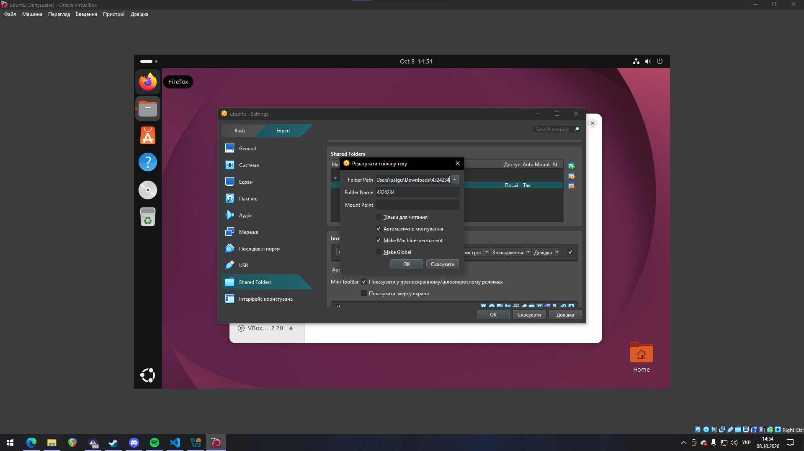
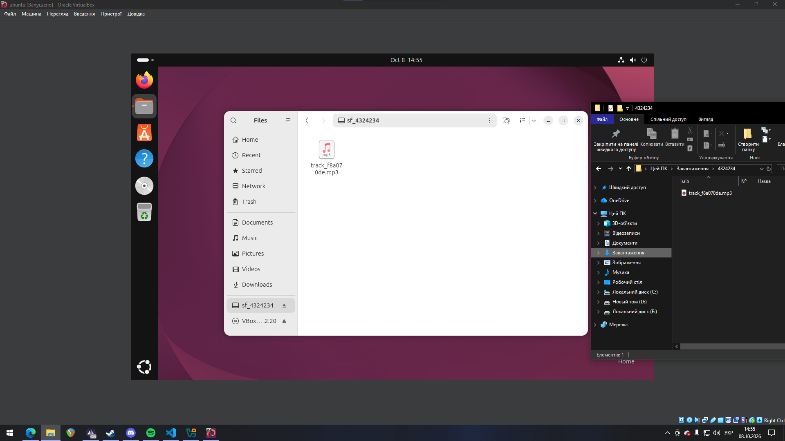

# Work-case 3
# Роботу виконали студенти групи КСМ-43а: Пальгуй Богдан, Єршов Олексій, Гапонюк Назар
# Гапонюк Назар:
**Середовище віртуалізації:** Oracle VirtualBox
**Гостьова ОС:** Ubuntu 25.04 (64-bit)
---

## Завдання 1. Клонування та експорт віртуальної машини

### 1.1. Клонування віртуальної робочої ОС

Клонування - це створення точної копії віртуальної машини (ВМ) з усіма налаштуваннями та вмістом віртуального диска. Клон можна використовувати як окрему ВМ, наприклад, для побудови мережі між двома машинами.

**Етапи виконання:**

1. Вимкнути вихідну ВМ (`Linux`, створена в Work-case 2).
2. У VirtualBox Менеджері клікнути правою кнопкою миші по ВМ → **Клонувати** (або натиснути `Ctrl+O`).
3. У вікні «Клонувати віртуальну машину» вказати:
   - **Ім'я:** `WorkOS-clone`;
   - **Шлях:** `C:\Users\user\VirtualBox VMs`;
   - **Тип клонування:** *Повне клонування* (створюється незалежна копія віртуального диска; при «зв'язаному» клонуванні зберігаються лише відмінності від оригіналу);
   - **Ціль клонування:** *Поточний стан машини*;
   - **Політика MAC-адреси:** *Згенерувати нові MAC-адреси всіх мережевих адаптерів* (щоб у мережі не було двох пристроїв з однаковими MAC-адресами).
4. Натиснути **Готово** і дочекатися завершення клонування.

**Скріншот 1.** Вікно клонування віртуальної машини з обраними параметрами


---

**Налаштування клона після першого запуску.** Оскільки клон є точною копією, у нього збігаються ім'я хоста та ідентифікатор машини (`machine-id`) з оригіналом. Щоб ВМ відрізнялися одна від одної (наприклад, для DHCP та мережевих сервісів), у клоні виконуємо команди:

```bash
sudo hostnamectl set-hostname clone-os
sudo rm /etc/machine-id && sudo systemd-machine-id-setup
```

Пояснення команд:

| Команда | Призначення |
|---|---|
| `hostnamectl set-hostname clone-os` | змінює ім'я хоста на `clone-os` |
| `rm /etc/machine-id` | видаляє успадкований від оригіналу унікальний ідентифікатор машини |
| `systemd-machine-id-setup` | генерує новий випадковий `machine-id` |

Нове ім'я хоста повністю застосовується після перезавантаження або повторного входу в систему.

**Скріншот 2.** Клон `WorkOS-clone`: зміна імені хоста та генерація нового machine-id


---

### 1.2. Експорт віртуальної ОС для перенесення в інше віртуальне середовище

Для перенесення ВМ в інше середовище віртуалізації (інший комп'ютер, інша копія VirtualBox, VMware Workstation тощо) її експортують у відкритий стандартний формат **OVF/OVA**. Файл `.ova` - це архів, що містить опис конфігурації ВМ (`.ovf`), образ віртуального диска (`.vmdk`/`.vdi`) та, за потреби, manifest-файл із контрольними сумами.

**Етапи виконання:**

1. Вимкнути ВМ, яку експортуємо.
2. У VirtualBox Менеджері обрати **Файл → Експорт конфігурацій** (`Ctrl+E`).
3. У списку «Віртуальні машини» обрати ВМ для експорту (`WorkOS-clone`) і натиснути **Далі/Готово**.

**Скріншот 3.** Вибір віртуальної машини для експорту


---

4. У розділі **Параметри формату** вказати:
   - **Формат:** Відкритий формат віртуалізації 2.0 (OVF 2.0);
   - **Файл:** `C:\Users\user\Documents\WorkOS-clone.ova` (розширення `.ova` - усе пакується в один файл);
   - **Політика MAC-адреси:** *Включати тільки MAC-адреси мережевого адаптера NAT*;
   - **Створити Manifest-файл:** увімкнено (для перевірки цілісності архіву під час імпорту);
   - **Включати ISO файли образів:** вимкнено.
5. Натиснути **Готово** (у розділі «Параметри експорту» за потреби змінити назву й опис ВМ) та дочекатися завершення запису конфігурації. Результат - файл `WorkOS-clone.ova`, який можна скопіювати на інший комп'ютер.

**Скріншот 4.** Параметри формату експорту


---

**Імпорт у нове середовище (перевірка експорту).**

1. У VirtualBox: **Файл → Імпорт конфігурацій** (у VMware Workstation: *File → Open*).
2. У полі «Файл» вказати створений `WorkOS-clone.ova`.

**Скріншот 5.** Вибір файлу `WorkOS-clone.ova` для імпорту


---

3. У параметрах імпорту за потреби обрати «Згенерувати нові MAC-адреси», натиснути **Готово**.
4. Після завершення імпорту в списку з'являється нова ВМ `WorkOS-clone 1` (Ubuntu 25.04, 4096 МБ ОЗП, 4 процесори, диск 25 ГБ), що підтверджує успішне перенесення ВМ.

**Скріншот 6.** Імпортована віртуальна машина в списку VirtualBox


---

## Завдання 2. Типи організації мережевих з'єднань віртуальних машин

Для взаємодії віртуальних машин між собою, з основною ОС (хостом) та з Інтернетом у середовищах віртуалізації використовуються різні режими роботи віртуального мережевого адаптера.

| Тип з'єднання | Принцип роботи та особливості | ВМ ↔ ВМ | ВМ ↔ хост | ВМ → Інтернет | Зовнішня мережа → ВМ |
|---|---|:---:|:---:|:---:|:---:|
| **NAT** (трансляція мережевих адрес) | ВМ виходить в Інтернет через IP-адресу хоста, подібно до пристрою за домашнім роутером. Кожна ВМ отримує приватну адресу та ізольована від інших ВМ. Доступ ззовні до ВМ можливий лише через **проброс портів** (port forwarding). Режим за замовчуванням, найпростіший для доступу до Інтернету. | ні | ні (лише через проброс портів) | так | ні (лише через проброс портів) |
| **Bridged** (мережевий міст) | ВМ підключається до фізичної мережі через мережевий адаптер хоста та отримує власну IP-адресу від DHCP-сервера (роутера), як окремий реальний комп'ютер. ВМ видима для інших пристроїв локальної мережі. | так | так | так | так |
| **Host-only** (віртуальний адаптер хоста) | Створюється приватна віртуальна мережа лише між хостом і ВМ (за замовчуванням `192.168.56.0/24`). ВМ бачать одна одну та хост, але виходу в Інтернет немає (без додаткового налаштування). | так | так | ні | ні |
| **Internal Network** (внутрішня мережа) | Повністю ізольована мережа лише між ВМ з однаковою назвою внутрішньої мережі. Хост у ній не бере участі. Використовується для безпечних тестових стендів. | так | ні | ні | ні |


# Олексій Єршов:
## Завдання 3. Розгортання мережі між робочою ОС та її клоном

Для цього завдання використовуємо дві віртуальні машини: оригінальну `WorkOS` (Work-case 2) та її клон `WorkOS-clone` (з завдання 1, ім'я хоста `clone-os`). Щоб обидві ВМ мали і вихід в Інтернет, і зв'язок між собою, кожній ВМ додаємо по два мережеві адаптери:

- **Адаптер 1 - NAT** - для виходу в Інтернет;
- **Адаптер 2 - Внутрішня мережа (Internal Network)** з назвою `intnet` - для зв'язку між двома ВМ.

### 3.1. Налаштування адаптерів у VirtualBox

1. Вимикаємо обидві ВМ (змінювати адаптери можна тільки на вимкненій машині).
2. У VirtualBox Менеджері обираємо ВМ → **Налаштування** → **Мережа**.
3. На вкладці **Адаптер 1** залишаємо **Тип підключення:** *NAT*.
4. На вкладці **Адаптер 2** ставимо галочку **Увімкнути мережевий адаптер**, **Тип підключення:** *Внутрішня мережа*, **Ім'я:** `intnet`.
5. Те саме робимо для `WorkOS-clone` (ім'я мережі `intnet` має бути однакове, інакше машини не побачать одна одну). Запускаємо обидві ВМ.

### 3.2. Базові команди для налаштування мережі

Спочатку дивимось, які інтерфейси є в системі:

```bash
ip a
```

Бачимо `lo` (loopback), `enp0s3` (адаптер 1, NAT, адресу отримав автоматично по DHCP, `10.0.2.15`) та `enp0s8` (адаптер 2, поки без адреси).

Основні команди, які використовували:

| Команда | Що виконує |
|---|---|
| `ip a` (`ip addr`) | показує інтерфейси та їхні IP-адреси |
| `ip link` | показує стан інтерфейсів (UP/DOWN) та MAC-адреси |
| `ip route` | показує таблицю маршрутизації (шлюз за замовчуванням) |
| `hostname -I` | виводить усі IP-адреси цієї машини |
| `nmcli device status` | показує стан мережевих пристроїв у NetworkManager |
| `nmcli con add ...` | створює нове мережеве підключення з потрібними параметрами |
| `nmcli con up <ім'я>` | вмикає підключення |
| `resolvectl status` | показує DNS-сервери, які використовує система |
| `ping <адреса>` | перевіряє, чи доступний інший вузол мережі |

Інтерфейс `enp0s8` на кожній ВМ налаштовуємо вручну (статична адреса), бо DHCP-сервера у внутрішній мережі немає.

На `WorkOS`:

```bash
sudo nmcli con add type ethernet ifname enp0s8 con-name intnet ipv4.method manual ipv4.addresses 192.168.100.1/24
sudo nmcli con up intnet
```

На `WorkOS-clone`:

```bash
sudo nmcli con add type ethernet ifname enp0s8 con-name intnet ipv4.method manual ipv4.addresses 192.168.100.2/24
sudo nmcli con up intnet
```

Пояснення параметрів:

| Параметр | Значення |
|---|---|
| `type ethernet` | тип підключення - дротовий Ethernet |
| `ifname enp0s8` | до якого інтерфейсу прив'язуємо підключення |
| `con-name intnet` | назва підключення (довільна) |
| `ipv4.method manual` | адреса задається вручну, а не через DHCP |
| `ipv4.addresses 192.168.100.1/24` | IP-адреса та маска (`/24` = `255.255.255.0`) |

Перевіряємо, що адреса з'явилась: `ip a show enp0s8`. Далі перевіряємо зв'язок між машинами:

```bash
# з WorkOS
ping -c 4 192.168.100.2
# з WorkOS-clone
ping -c 4 192.168.100.1
```

Якщо пакети проходять і втрат 0% - внутрішня мережа працює.

> Цей самий результат можна отримати і без NetworkManager, командою `sudo ip addr add 192.168.100.1/24 dev enp0s8` та `sudo ip link set enp0s8 up`, але після перезавантаження налаштування зникнуть, тому ми використали `nmcli`.

### 3.3. Вихід в Інтернет

Інтернет на обох ВМ іде через адаптер 1 (NAT). Перевіряємо:

```bash
ping -c 4 8.8.8.8
ping -c 4 google.com
```

Перший `ping` перевіряє, що є доступ до Інтернету за IP, другий - що працює ще й DNS (розпізнавання імен). Потім на кожній ВМ відкриваємо браузер (Firefox), заходимо на `youtube.com` та вмикаємо будь-яке відео. Відео відтворюється на обох ВМ, отже вихід в Інтернет є.

### 3.4. Обмін повідомленнями між ОС по локальній мережі

Для обміну повідомленнями використовуємо утиліту **netcat** (`nc`). Вона відкриває TCP-з'єднання між двома машинами, і все, що вводимо в одному терміналі, з'являється в іншому. Якщо її немає, встановлюємо: `sudo apt install netcat-openbsd`.

1. На `WorkOS` запускаємо «сервер», який слухає порт 5000:

```bash
nc -l 5000
```

2. На `WorkOS-clone` підключаємось до нього за IP-адресою:

```bash
nc 192.168.100.1 5000
```

3. Пишемо текст у терміналі клона й натискаємо Enter - повідомлення з'являється на `WorkOS`. Те саме працює в зворотний бік. Щоб завершити чат, натискаємо `Ctrl+C`.

Пояснення: `-l` (listen) - режим очікування підключення, `5000` - номер порту (може бути будь-який вільний більше 1024).

### 3.5. Спільна мережева папка (Samba)

Спільну папку розгортаємо через **Samba** (протокол SMB). Сервером буде `WorkOS`, клієнтом - `WorkOS-clone`.

**На `WorkOS` (сервер):**

1. Встановлюємо Samba та створюємо теку:

```bash
sudo apt update
sudo apt install samba -y
sudo mkdir -p /srv/share
sudo chown $USER:$USER /srv/share
```

2. Додаємо опис теки в кінець конфігу `/etc/samba/smb.conf`:

```bash
sudo nano /etc/samba/smb.conf
```

```ini
[share]
   path = /srv/share
   browseable = yes
   read only = no
   valid users = user
```

(замість `user` - ім'я нашого користувача в системі).

3. Задаємо пароль користувача для Samba (він окремий від системного) та перезапускаємо службу:

```bash
sudo smbpasswd -a $USER
sudo systemctl restart smbd
```

4. Кладемо у спільну теку тестовий файл:

```bash
echo "hello from WorkOS" > /srv/share/test.txt
```

**На `WorkOS-clone` (клієнт):**

1. Встановлюємо клієнт та підключаємо теку:

```bash
sudo apt install cifs-utils smbclient -y
sudo mkdir -p /mnt/share
sudo mount -t cifs //192.168.100.1/share /mnt/share -o username=user
```

Система запитає пароль - вводимо той, що створили через `smbpasswd`. Перевіряємо: `ls /mnt/share` - має бути видно `test.txt`.

(Те саме можна зробити через файловий менеджер: **Інші розташування** → `smb://192.168.100.1/share`.)

**Копіювання файлів:**

На `WorkOS` копіюємо файл зі спільної теки в домашній каталог:

```bash
cp /srv/share/test.txt ~/
```

На `WorkOS-clone` копіюємо файл зі змонтованої теки на робочий стіл:

```bash
cp /mnt/share/test.txt ~/Desktop/
```

Файл з'явився в домашній теці `WorkOS` та на робочому столі `WorkOS-clone`, отже спільна мережева папка працює для обох ОС.

> Якщо `ping` між ВМ не проходить або Samba не підключається, потрібно перевірити, що ім'я внутрішньої мережі однакове на обох ВМ, а також що фаєрвол не блокує порти: `sudo ufw status` (у нашому випадку він вимкнений).


# Богдан Пальгуй:
## Завдання 4. Організація обміну інформацією між основною та віртуальними ОС

Для організації прямого обміну інформацією (файлами, текстом) між основною ОС (Windows) та гостьовими ВМ використовується функція **Drag and Drop** (Перетягування) або **Спільний буфер обміну**. Для їх коректної роботи в гостьовій ОС обов'язково мають бути встановлені Додатки гостьової ОС (*VirtualBox Guest Additions*). Оскільки в мене встановлена версія Ubuntu 26.04 LTS, на ній працює лише Wayland, тому функція drag and drop з VirtualBox тут працювати не буде, бо вона залежить від X11. Я переніс файл з основної ОС в ВМ через спільну теку.

**Етапи виконання (Drag and Drop):**

1. **Увімкнення функції:** У верхньому меню запущеної ВМ обираємо **Пристрої** → **Drag and Drop** → встановлюємо режим **Двонаправлений** (Bidirectional). Це ж саме робимо для клонованої ВМ.
2. **Копіювання з основної ОС у віртуальну:** Знаходимо наш аудіофайл у Windows, затискаємо його лівою кнопкою миші та перетягуємо у вікно віртуальної машини прямо на її робочий стіл. Процес повторюємо для клону.
3. **Зворотна дія (з віртуальної ОС в основну):** Беремо наш текстовий документ на робочому столі Ubuntu. Затискаємо його мишею у вікні ВМ та перетягуємо на робочий стіл основної ОС Windows.

**Етапи виконання (Спільна тека):**

1. **Створення теки:** У верхньому меню запущеної ВМ обираємо **Пристрої** → **Спільна теки** → **Параметри загальних тек** → Натискаємо на **+** → Обираємо теку на нашій основній ОС та ставимо галочки на **Автоматичне монтування** і **Make Machine-permanent** → натискаємо **ОК** 



2. **Копіювання з основної ОС у віртуальну та навпаки:** Знаходимо наш аудіофайл у Windows та переносимо його у теку яку ми обрали при створенні. Файл з'явиться в папці на ВМ. Щоб перенести файли з ВМ на основну ОС, треба так само перенести файли в папку, тільки на ВМ, вони з'являться в спільній папці на основній ОС.




## Conclusion

During Work-case 3, we practiced working with virtual machines in VirtualBox and completed all required network tasks.

- **Virtual Machine Cloning and Export:** We created a full clone of the `WorkOS` virtual machine named `WorkOS-clone`, changed its hostname, and generated new MAC addresses along with a new `machine-id`. We also exported the virtual machine into an `.ova` file to test VM migration to other environments.
- **Network Modes:** We explored the differences between NAT, Bridged Adapter, Host-only Adapter, and Internal Network, as well as how each mode handles traffic between virtual machines and the Internet.
- **Network Configuration and File Sharing:** We configured two network adapters on both VMs (NAT for Internet access and an Internal Network named `intnet` for direct communication). We verified IP addressing and routing using `ip a`, `ip route`, and `ping`, tested web browsing via YouTube, set up terminal messaging with `netcat`, and configured a shared network folder using Samba.
- **Host-Guest Communication:** We configured shared folders using VirtualBox Guest Additions, allowing us to transfer files between the host OS (Windows) and the guest Linux systems.

As a result, we gained practical experience in virtual machine administration, network configuration, and setting up shared network resources.
