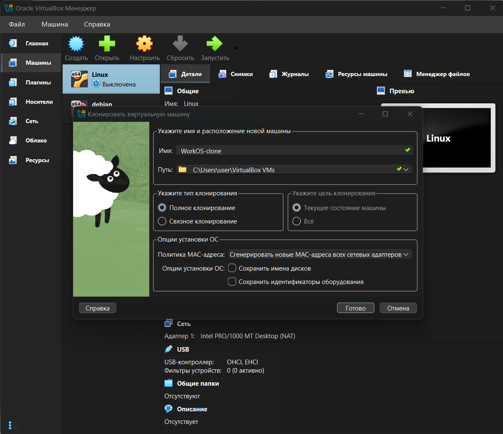
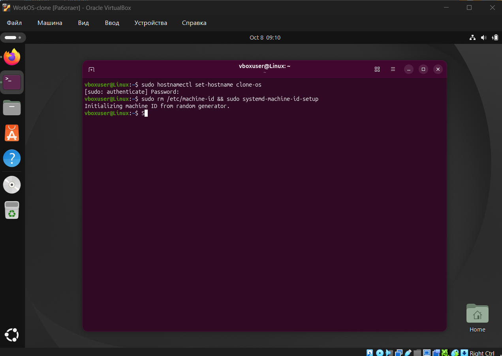
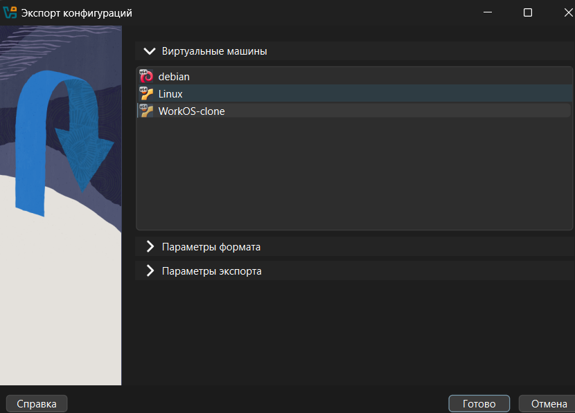
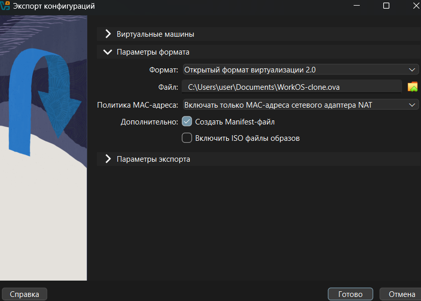
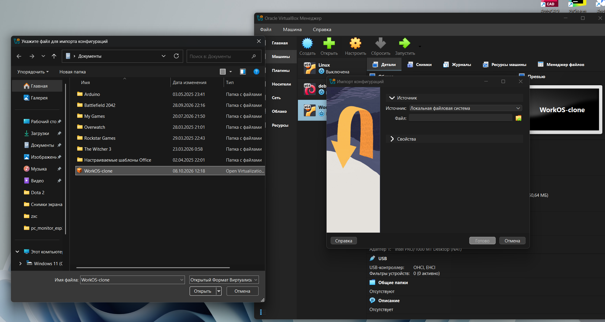
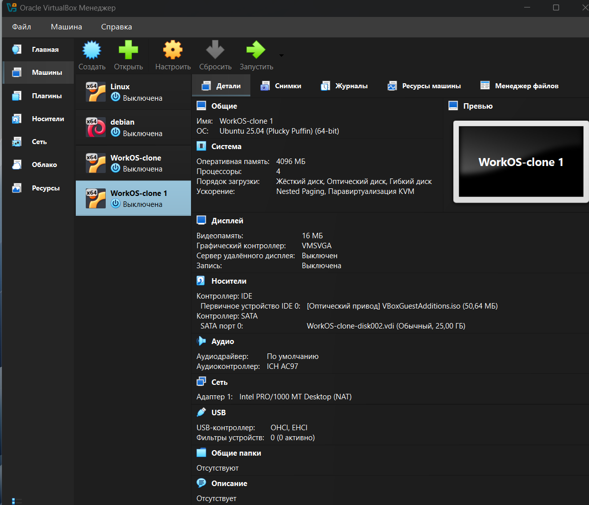

# Work-case 3

**Середовище віртуалізації:** Oracle VirtualBox
**Гостьова ОС:** Ubuntu 25.04 (64-bit)

---

## Завдання 1. Клонування та експорт віртуальної машини

### 1.1. Клонування віртуальної робочої ОС

Клонування - це створення точної копії віртуальної машини (ВМ) з усіма налаштуваннями та вмістом віртуального диска. Клон можна використовувати як окрему ВМ, наприклад, для побудови мережі між двома машинами.

**Етапи виконання:**

1. Вимкнути вихідну ВМ (`Linux`, створена в Work-case 2).
2. У VirtualBox Менеджері клікнути правою кнопкою миші по ВМ → **Клонувати** (або натиснути `Ctrl+O`).
3. У вікні «Клонувати віртуальну машину» вказати:
   - **Ім'я:** `WorkOS-clone`;
   - **Шлях:** `C:\Users\user\VirtualBox VMs`;
   - **Тип клонування:** *Повне клонування* (створюється незалежна копія віртуального диска; при «зв'язаному» клонуванні зберігаються лише відмінності від оригіналу);
   - **Ціль клонування:** *Поточний стан машини*;
   - **Політика MAC-адреси:** *Згенерувати нові MAC-адреси всіх мережевих адаптерів* (щоб у мережі не було двох пристроїв з однаковими MAC-адресами).
4. Натиснути **Готово** і дочекатися завершення клонування.

**Скріншот 1.** Вікно клонування віртуальної машини з обраними параметрами



---

**Налаштування клона після першого запуску.** Оскільки клон є точною копією, у нього збігаються ім'я хоста та ідентифікатор машини (`machine-id`) з оригіналом. Щоб ВМ відрізнялися одна від одної (наприклад, для DHCP та мережевих сервісів), у клоні виконуємо команди:

```bash
sudo hostnamectl set-hostname clone-os
sudo rm /etc/machine-id && sudo systemd-machine-id-setup
```

Пояснення команд:

| Команда | Призначення |
|---|---|
| `hostnamectl set-hostname clone-os` | змінює ім'я хоста на `clone-os` |
| `rm /etc/machine-id` | видаляє успадкований від оригіналу унікальний ідентифікатор машини |
| `systemd-machine-id-setup` | генерує новий випадковий `machine-id` |

Нове ім'я хоста повністю застосовується після перезавантаження або повторного входу в систему.

**Скріншот 2.** Клон `WorkOS-clone`: зміна імені хоста та генерація нового machine-id



---

### 1.2. Експорт віртуальної ОС для перенесення в інше віртуальне середовище

Для перенесення ВМ в інше середовище віртуалізації (інший комп'ютер, інша копія VirtualBox, VMware Workstation тощо) її експортують у відкритий стандартний формат **OVF/OVA**. Файл `.ova` - це архів, що містить опис конфігурації ВМ (`.ovf`), образ віртуального диска (`.vmdk`/`.vdi`) та, за потреби, manifest-файл із контрольними сумами.

**Етапи виконання:**

1. Вимкнути ВМ, яку експортуємо.
2. У VirtualBox Менеджері обрати **Файл → Експорт конфігурацій** (`Ctrl+E`).
3. У списку «Віртуальні машини» обрати ВМ для експорту (`WorkOS-clone`) і натиснути **Далі/Готово**.

**Скріншот 3.** Вибір віртуальної машини для експорту



---

4. У розділі **Параметри формату** вказати:
   - **Формат:** Відкритий формат віртуалізації 2.0 (OVF 2.0);
   - **Файл:** `C:\Users\user\Documents\WorkOS-clone.ova` (розширення `.ova` - усе пакується в один файл);
   - **Політика MAC-адреси:** *Включати тільки MAC-адреси мережевого адаптера NAT*;
   - **Створити Manifest-файл:** увімкнено (для перевірки цілісності архіву під час імпорту);
   - **Включати ISO файли образів:** вимкнено.
5. Натиснути **Готово** (у розділі «Параметри експорту» за потреби змінити назву й опис ВМ) та дочекатися завершення запису конфігурації. Результат - файл `WorkOS-clone.ova`, який можна скопіювати на інший комп'ютер.

**Скріншот 4.** Параметри формату експорту



---

**Імпорт у нове середовище (перевірка експорту).**

1. У VirtualBox: **Файл → Імпорт конфігурацій** (у VMware Workstation: *File → Open*).
2. У полі «Файл» вказати створений `WorkOS-clone.ova`.

**Скріншот 5.** Вибір файлу `WorkOS-clone.ova` для імпорту



---

3. У параметрах імпорту за потреби обрати «Згенерувати нові MAC-адреси», натиснути **Готово**.
4. Після завершення імпорту в списку з'являється нова ВМ `WorkOS-clone 1` (Ubuntu 25.04, 4096 МБ ОЗП, 4 процесори, диск 25 ГБ), що підтверджує успішне перенесення ВМ.

**Скріншот 6.** Імпортована віртуальна машина в списку VirtualBox



---

## Завдання 2. Типи організації мережевих з'єднань віртуальних машин

Для взаємодії віртуальних машин між собою, з основною ОС (хостом) та з Інтернетом у середовищах віртуалізації використовуються різні режими роботи віртуального мережевого адаптера.

| Тип з'єднання | Принцип роботи та особливості | ВМ ↔ ВМ | ВМ ↔ хост | ВМ → Інтернет | Зовнішня мережа → ВМ |
|---|---|:---:|:---:|:---:|:---:|
| **NAT** (трансляція мережевих адрес) | ВМ виходить в Інтернет через IP-адресу хоста, подібно до пристрою за домашнім роутером. Кожна ВМ отримує приватну адресу та ізольована від інших ВМ. Доступ ззовні до ВМ можливий лише через **проброс портів** (port forwarding). Режим за замовчуванням, найпростіший для доступу до Інтернету. | ні | ні (лише через проброс портів) | так | ні (лише через проброс портів) |
| **Bridged** (мережевий міст) | ВМ підключається до фізичної мережі через мережевий адаптер хоста та отримує власну IP-адресу від DHCP-сервера (роутера), як окремий реальний комп'ютер. ВМ видима для інших пристроїв локальної мережі. | так | так | так | так |
| **Host-only** (віртуальний адаптер хоста) | Створюється приватна віртуальна мережа лише між хостом і ВМ (за замовчуванням `192.168.56.0/24`). ВМ бачать одна одну та хост, але виходу в Інтернет немає (без додаткового налаштування). | так | так | ні | ні |
| **Internal Network** (внутрішня мережа) | Повністю ізольована мережа лише між ВМ з однаковою назвою внутрішньої мережі. Хост у ній не бере участі. Використовується для безпечних тестових стендів. | так | ні | ні | ні |

