# ЗВІТ

## З лабораторної роботи №5

**Дисципліна:** Операційні системи

**Тема:** «Знайомство з командами навігації по файловій системі та керування файлами та каталогами»

**Виконали:** студенти групи КСМ-43а

- Гапонюк Назар
- Пальгуй Богдан
- Єршов Олексій

# Гапонюк Назар:
---

## Тема роботи

Знайомство з командами навігації по файловій системі та керування файлами та каталогами.

## Мета роботи

- Отримання практичних навиків роботи з командною оболонкою Bash.
- Знайомство з базовими командами навігації по файловій системі.
- Знайомство з базовими командами для керування файлами та каталогами.

---

## 1. Словник термінів

| Термін | Переклад / пояснення |
| --- | --- |
| filesystem | файлова система - спосіб організації та зберігання файлів і каталогів на носії |
| directory | каталог (папка) - особливий тип файлу, що зберігає інші файли |
| root directory | кореневий каталог, вершина ієрархії файлової системи Linux, позначається `/` |
| home directory | домашній каталог користувача, з якого починається його сеанс (`~`) |
| working directory | поточний робочий каталог, у якому користувач перебуває зараз |
| path | шлях до файлу або каталогу |
| absolute path | абсолютний шлях - починається з кореня `/` |
| relative path | відносний шлях - відраховується від поточного каталогу |
| parent directory | батьківський (вищий) каталог, позначається `..` |
| hidden file | прихований файл, ім'я якого починається з крапки |
| change directory (`cd`) | змінити каталог |
| print working directory (`pwd`) | вивести поточний робочий каталог |
| list (`ls`) | вивести вміст каталогу |
| copy (`cp`) | копіювати |
| move (`mv`) | перемістити або перейменувати |
| remove (`rm`) | видалити |
| make directory (`mkdir`) | створити каталог |
| remove directory (`rmdir`) | видалити порожній каталог |
| concatenate (`cat`) | вивести вміст файлу на екран |
| option / flag | параметр (ключ) команди, наприклад `-l` |
| argument | аргумент команди - об'єкт, над яким виконується дія |
| recursive (`-r`, `-R`) | рекурсивно, включно з усіма вкладеними каталогами |
| interactive (`-i`) | з запитом підтвердження перед дією |
| verbose (`-v`) | докладний вивід про виконані дії |
| no clobber (`-n`) | не перезаписувати існуючий файл |
| glob / wildcard | символи-шаблони (`*`, `?`, `[ ]`, `!`) для вибору імен файлів |
| redirect (`>`) | перенаправлення виводу команди у файл |
| shell | командна оболонка (інтерпретатор команд), у нашому випадку Bash |
| permission | права доступу до файлу або каталогу |
| FHS | Filesystem Hierarchy Standard - стандарт ієрархії файлової системи |

---

## 2. Відповіді на питання для попередньої підготовки

### 2.1. Порівняння файлових структур Windows-подібної та Linux-подібної систем

| Критерій | Windows | Linux |
| --- | --- | --- |
| Вершина ієрархії | «Мій комп'ютер» (My Computer / This PC), під яким відображаються пристрої | Єдиний кореневий каталог `/` (root) |
| Пристрої зберігання | Кожному розділу чи пристрою призначається літера диска: `C:`, `D:` тощо | Дисків-літер немає: кожен пристрій підключається (монтується) до певного каталогу, наприклад `/media`, `/mnt` |
| Роздільник у шляху | Зворотна коса риска `\` (`C:\Users\vboxuser`) | Пряма коса риска `/` (`/home/vboxuser`) |
| Регістр в іменах | Зазвичай не враховується | Враховується: `File` і `file` - різні файли |
| Домашній каталог | `C:\Users\<ім'я>` | `/home/<ім'я>` |
| Структура | Кілька незалежних дерев (по одному на диск) | Єдине віртуальне дерево каталогів |
| Принцип | Файли, папки та пристрої розрізняються | «Все є файл», навіть пристрої (`/dev`) |

Отже, головна відмінність: у Windows файлова система складається з кількох дерев за літерами дисків, а в Linux - з одного дерева з єдиним коренем `/`, у яке «вбудовуються» усі пристрої.

### 2.2. Поняття FHS

**FHS (Filesystem Hierarchy Standard)** - це стандарт, що визначає назви основних каталогів файлової системи Linux-подібних систем і їх призначення. Завдяки йому каталоги з однаковими іменами виконують однакові функції в різних дистрибутивах.

Приклади: `/bin` - базові програми, `/etc` - конфігураційні файли, `/home` - домашні каталоги користувачів, `/var` - файли, що часто змінюються (логи), `/tmp` - тимчасові файли, `/dev` - файли пристроїв, `/usr` - основна частина програм і даних користувача.

Використання стандарту дає користувачу й адміністратору можливість швидко знаходити потрібні файли в будь-якому FHS-сумісному дистрибутиві, а розробникам програмного забезпечення - розраховувати на передбачувану структуру системи.

### 2.3. Основні команди для роботи з файлами та каталогами

| Дія | Команда | Приклад |
| --- | --- | --- |
| Створення порожнього файлу | `touch` | `touch file.txt` |
| Створення каталогу | `mkdir` | `mkdir mydir` |
| Копіювання | `cp` | `cp file.txt copy.txt`, `cp -r dir1 dir2` |
| Переміщення / перейменування | `mv` | `mv file.txt dir/`, `mv old.txt new.txt` |
| Видалення файлу | `rm` | `rm file.txt` |
| Видалення каталогу | `rmdir` (порожній), `rm -r` (з вмістом) | `rmdir mydir`, `rm -r mydir` |
| Перегляд вмісту каталогу | `ls` | `ls -l` |
| Перегляд вмісту файлу | `cat` | `cat file.txt` |

---
# Пальгуй Богдан:
## 3. Хід роботи

### 2. Опис команд (за матеріалами NDG Linux Essentials, Lab 7 та Lab 8)

| Назва команди | Її призначення та функціональність |
| --- | --- |
| `pwd` | Визначає місце знаходження користувача у файловій системі, показує поточну робочу директорію (print working directory) |
| `cd Documents` | Команда **cd** здійснює перехід до каталогу, який у неї вказаний як аргумент. В даному випадку це каталог **Documents** |
| `cd /` | Перехід до кореневого каталогу |
| `cd ~` або `cd` | Перехід до домашнього каталогу поточного користувача |
| `cd ..` | Перехід до батьківського (вищого) каталогу |
| `cd -` | Повернення до попереднього каталогу, у якому користувач був до останнього `cd` |
| `ls` | Виводить список файлів і каталогів поточного (або вказаного) каталогу |
| `ls -l` | Довгий формат: права доступу, власник, група, розмір, дата зміни, ім'я |
| `ls -a` | Показує всі файли, включно з прихованими (імена яких починаються з `.`) |
| `ls -r` | Виводить вміст у зворотному (до алфавітного) порядку |
| `ls -R` | Рекурсивно виводить вміст каталогу та всіх його підкаталогів |
| `ls /etc/[!DP]*` | Приклад globbing: файли в `/etc`, що не починаються з літер D або P |
| `*` | Glob-символ: нуль або більше довільних символів в імені файлу |
| `?` | Glob-символ: рівно один довільний символ |
| `[ ]` | Glob-символ: один символ із вказаного набору або діапазону |
| `!` | Заперечення діапазону в квадратних дужках (`[!DP]`) |
| `touch file` | Створює порожній файл (0 байт); якщо файл існує - оновлює час його зміни |
| `mkdir dir` | Створює каталог; приймає кілька аргументів, тож кілька каталогів можна створити однією командою |
| `echo "text" > file` | Виводить текст і за допомогою `>` перенаправляє його у файл (вміст файлу перезаписується) |
| `cat file` | Виводить вміст файлу на екран |
| `cp source dest` | Копіює файл; при успіху нічого не виводить. Якщо файл призначення існує - перезаписує його |
| `cp -v` | Копіювання з докладним виводом про виконану дію |
| `cp -r` | Копіювання каталогів разом із вмістом (рекурсивно) |
| `mv source dest` | Переміщує файл у новий каталог або перейменовує його, якщо вказано нове ім'я |
| `mv -i` | Запитує підтвердження перед перезаписом існуючого файлу |
| `mv -n` | Не перезаписує існуючий файл (no clobber) |
| `mv -v` | Показує результат переміщення (verbose) |
| `rm file` | Видаляє файл без запитань (у файловому менеджері «кошика» немає) |
| `rm -i` | Видалення із запитом підтвердження, безпечніше при використанні glob-символів |
| `rm -r dir` | Видаляє каталог разом з усім вмістом (рекурсивно) |
| `rmdir dir` | Видаляє каталог, але лише порожній |

### 3. Робота в терміналі
> Команди виконувалися в ОС Ubuntu, користувач `vboxuser`, хост `ubuntu`. Назви каталогів і файлів записано латиницею: група - `KSM-43a`, каталоги - `Palguy`, `Haponiuk`, `Yershov`, файли - `Bohdan`, `Nazar`, `Oleksii`.

**1) Визначення поточного робочого каталогу**

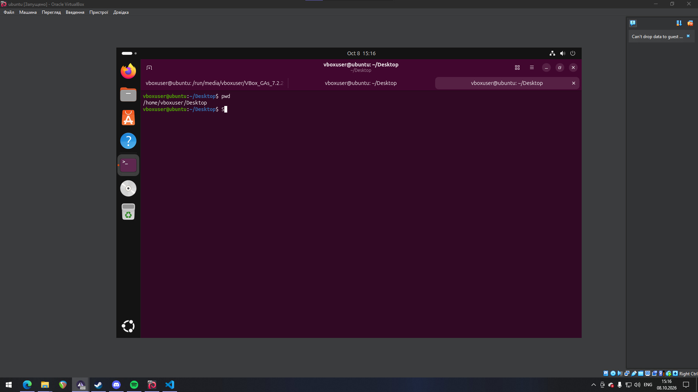

**2) Перехід до кореневого каталогу та визначення поточного каталогу (дві команди)**

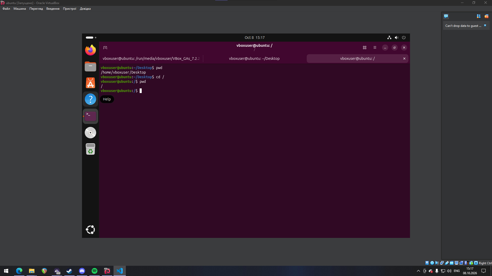

**3) Перегляд вмісту поточного каталогу у довгому форматі (`ls -l`)**

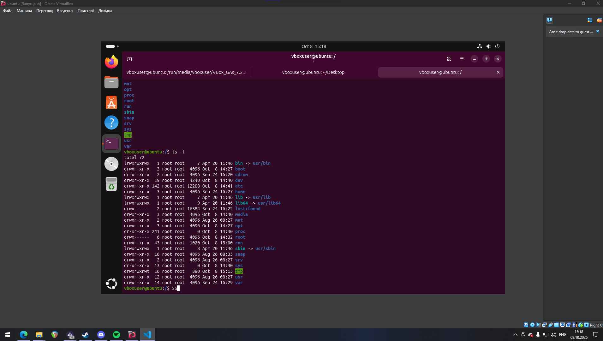

Ключ `-l` виводить для кожного об'єкта тип і права доступу, кількість посилань, власника, групу, розмір, дату зміни та ім'я. Символ `d` на початку рядка означає каталог, `l` - символічне посилання.

**4) Перехід до каталогу `/usr/share` та визначення поточного каталогу (дві команди)**

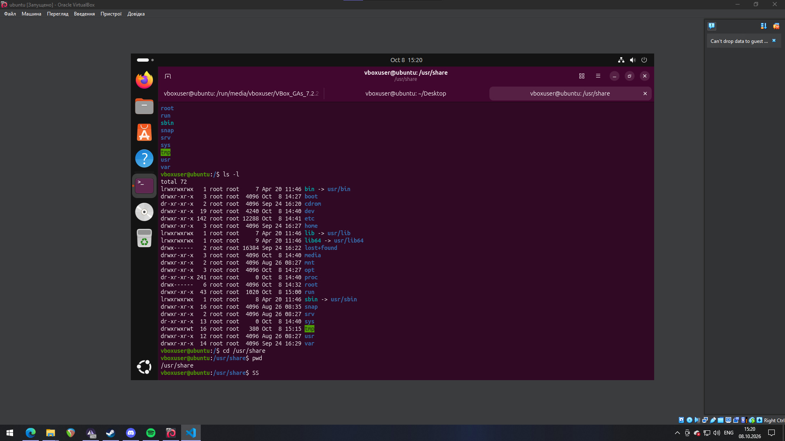

**5) Перегляд вмісту поточного каталогу разом із прихованими файлами (`ls -a`)**

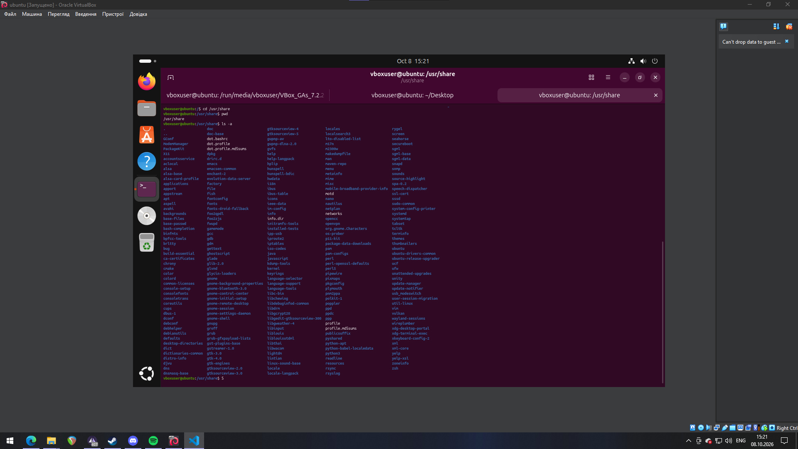

Ключ `-a` додає до виводу приховані файли та службові записи `.` (поточний каталог) і `..` (батьківський каталог).

**6) \*Перехід до каталогу `/etc`**

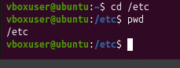

**7) \*Файли каталогу `/etc`, назви яких починаються з літери імені (Богдан - літера `B`)**

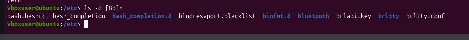

**8) \*Файли каталогу `/etc`, назви яких складаються з 6 літер**

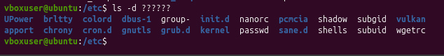

**9) \*\*Файли каталогу `/etc`, назви яких закінчуються на перші літери імен студентів команди (Богдан, Назар, Олексій - літери `b`, `n`, `o`)**

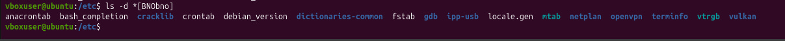

**10) \*\*Перехід до домашнього каталогу та перегляд його вмісту у рекурсивному зворотному до алфавітного форматі (через конвеєр)**

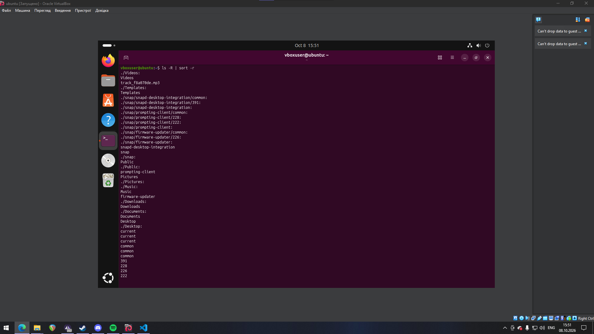

**11) Створення в поточній директорії каталогу з назвою групи**

**12) Оновлений вміст домашнього каталогу з ключем `-r`**

**13) Перехід у каталог групи та створення порожнього файлу `lab5`**

**14) Створення трьох каталогів із прізвищами студентів однією командою**

**15) Перехід у перший підкаталог `Palguy` та створення порожнього файлу з ім'ям першого студента `Bohdan`**

**16) Внесення даних про студента у файл `Bohdan`**

**17) Перегляд вмісту файлу `Bohdan`**

**18) Копія першого файлу з ім'ям другого студента `Nazar`**

**19) Перегляд вмісту каталогу**

**20) Перегляд вмісту другого файлу `Nazar`**

**21) Заміна вмісту файлу `Nazar`**

**22) Перегляд оновленого вмісту другого файлу**

**23) Переміщення файлу `Nazar` у каталог `Haponiuk`**

**24) Копія першого файлу з ім'ям третього студента `Oleksii`**

**25) Переміщення файлу `Oleksii` у каталог `Yershov`**

**26) Перехід до каталогу `Yershov`**

**27) Перегляд вмісту третього файлу**

**28) Заміна вмісту файлу `Oleksii`**

**29) Перегляд оновленого вмісту файлу**

**30) Повернення до домашнього каталогу користувача**

**31) \*\*Перегляд лише каталогу групи та всього його вмісту з відокремленням кольорами**

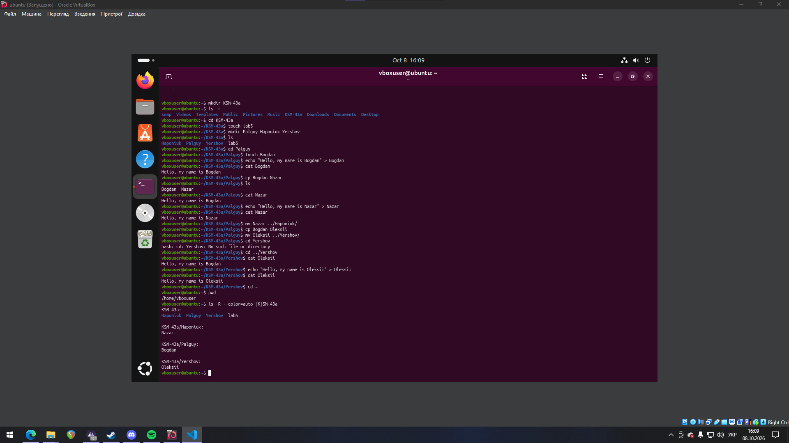

### 3.3. Дії команд для переміщення по системі каталогів

| Команда | Дія |
| --- | --- |
| `cd /` | Перехід до кореневого каталогу файлової системи (абсолютний шлях `/`) |
| `cd /home` | Перехід до каталогу `/home`, де зберігаються домашні каталоги користувачів (абсолютний шлях) |
| `cd ~` | Перехід до домашнього каталогу поточного користувача; символ `~` є скороченням для нього |
| `cd` (без аргумента) | Те саме, що `cd ~`: перехід до домашнього каталогу поточного користувача |
| `cd ..` | Перехід на один рівень вгору, до батьківського каталогу |
| `cd ../..` | Перехід на два рівні вгору (до батьківського каталогу батьківського каталогу) |
| `cd -` | Повернення до каталогу, у якому користувач перебував до попереднього переходу; шлях цього каталогу виводиться на екран |
