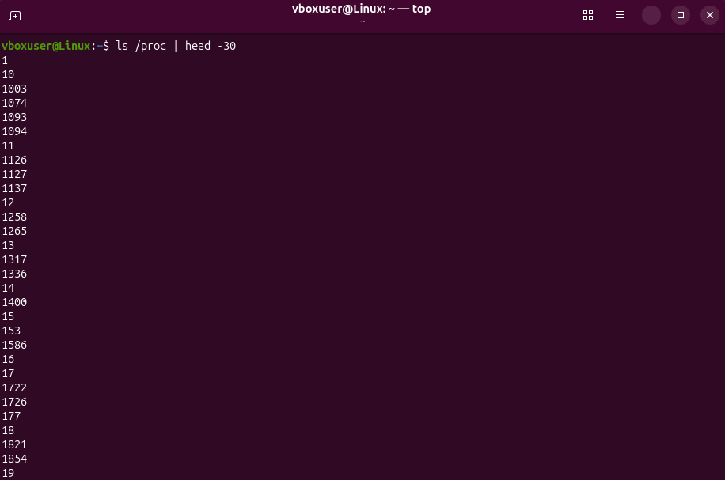
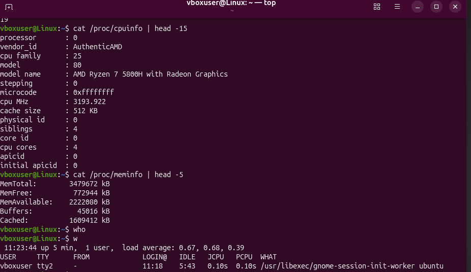
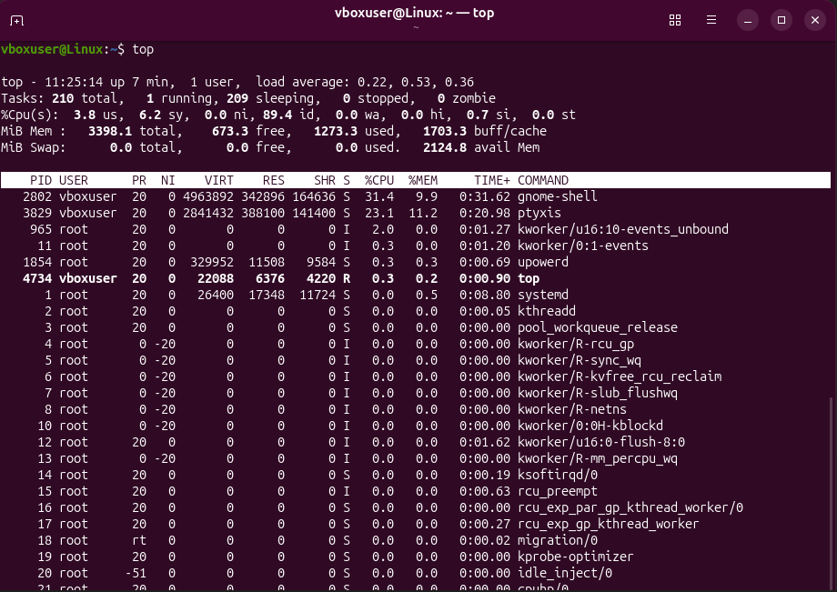

# Звіт до лабораторної роботи №4
# Роботу виконали студенти групи КСМ-43а: Пальгуй Богдан, Єршов Олексій, Гапонюк Назар
**Topic:** Команди Linux для управління процесами

**Objective:** Отримання practical skills роботи з командною оболонкою Bash та знайомство з basic commands для process management.

## Завдання для попередньої підготовки

# Пальгуй Богдан:
### 1. Vocabulary of Basic English Terms

* **Process** – програма, що виконується в system. Кожен запущений додаток чи команда створює один або кілька processes.
* **PID (Process ID)** – унікальний числовий identifier процесу, за яким система розрізняє запущені програми.
* **PPID (Parent Process ID)** – identifier батьківського процесу (тієї програми, яка ініціювала запуск поточного процесу).
* **TTY (Teletype/Terminal)** – terminal, з якого був запущений process.
* **Foreground** – процес на передньому плані. Він займає terminal та блокує введення нових commands до свого завершення.
* **Background** – фоновий процес. Виконується непомітно, звільняючи terminal для іншої роботи.
* **Signal** – повідомлення, що відправляється процесу для управління ним (наприклад, зупинки `TERM` або примусового завершення `KILL`).
* **Zombie process** – процес, що завершив свою роботу, але його parent process ще не отримав status завершення. Він не споживає CPU, але займає запис у таблиці процесів.
* **Real-time monitoring** – відслідковування стану системи в реальному часі (динамічне оновлення інформації).

### 2. Відповіді на питання (Q&A)

**2.1. Які команди для monitoring стану процесів ви знаєте. Як переглянути їх можливі parameters?**

Основні commands для monitoring:
* `ps` – показує status процесів на момент запуску команди.
* `top` – забезпечує real-time monitoring системи.
Щоб дізнатися доступні parameters, можна використати manual pages (команди `man ps` або `man top`), або запустити команди з прапорцем `--help`.

**2.2. Чи може команда ps у реальному часі відслідковувати стан процесів?**

Ні, `ps` робить лише одноразовий snapshot (знімок) системи. Вона показує інформацію для specific point in time. Для динамічного відслідковування (real-time mode) розроблена команда `top`.

**2.3. За якими параметрами можливе сортування процесів в команді top? Як переключатись між ними?**

За default, `top` сортує processes за рівнем використання процесора (`%CPU`). Щоб змінити sort order під час роботи `top`, потрібно натиснути клавішу `f` (fields). Відкриється interactive menu, де можна обрати інший параметр, наприклад `%MEM` (використання пам'яті) або `TIME+` (загальний час роботи).

**2.4. Які команди для завершення роботи процесів ви знаєте?**

Для stopping processes використовують дві основні команди:
* `kill` – надсилає signal (зазвичай `TERM` або `KILL`) вказаному PID. Вимагає точного знання ідентифікатора.
* `killall` – завершує всі processes, що відповідають певному command name. Дозволяє використовувати wildcards (наприклад, `killall http*`).

## Procedure (Хід роботи)

### 1. Початкова робота в CLI-режимі

Виконано login у систему Linux (Ubuntu). Запущено terminal application для отримання доступу до Bash shell.

### 2. Робота з процесами: Аналіз та Управління

**Як вивести вміст директорії /proc? Де вона знаходиться та для чого призначена? Охарактеризуйте інформацію про її вміст?**
Для перегляду використовується command `ls /proc`. Це особлива virtual file system, розташована в root directory (`/`). Вона не займає місця на диску, а створюється в пам'яті (RAM). `/proc` містить інформацію про поточний kernel status та hardware. Найголовніше: для кожного запущеного процесу тут створюється окрема directory, названа його PID (наприклад, `/proc/1234`), де зберігається detailed information про його пам'ять, параметри запуску та стан.

**Як вивести інформацію про поточні сеанси користувачів. Якою командою це можна зробити?**
Для перегляду logged-in users можна використати:
* `who` – показує, хто зараз у системі та з якого terminal.
* `w` – надає розширену інформацію: хто онлайн, що вони роблять (поточна command) та system load.
* `users` – виводить лише короткий список імен.

**Які дії можна зробити в терміналі за допомогою комбінацій Ctrl+C, Ctrl+D та Ctrl+Z?**
Ці shortcuts відправляють спеціальні signals системі:
* **Ctrl+C (SIGINT):** Перериває (interrupts) поточний foreground process, примусово зупиняючи його.
* **Ctrl+D (EOF):** Означає End Of File. У порожньому terminal це зазвичай закриває shell і робить logout.
* **Ctrl+Z (SIGTSTP):** Ставить поточний process на паузу (suspend) і переводить його у background, повертаючи користувачу доступ до CLI.

**Чим відрізняється фоновий процес (background) від звичайного (foreground). Де вони використовуються?**
* **Foreground:** Працює на передньому плані, взаємодіє з користувачем. Ви не можете вводити інші commands у terminal, поки він не завершиться.
* **Background:** Працює "у тіні". Звільняє terminal для інших задач. Використовується для тривалих operations (завантаження файлів, компіляція) або для system services (daemons), які працюють постійно без user interaction.

**Опишіть наступні команди та поясніть що вони виконують: jobs, bg, fg.**
* `jobs`: Відображає list усіх фонових задач (background jobs) поточної terminal session з їхніми статусами (Running або Stopped).
* `bg`: Передає signal продовжити роботу призупиненого процесу, але залишає його у background.
* `fg`: Повертає фоновий або призупинений process назад у foreground, щоб ви могли знову з ним взаємодіяти.

**Якою командою можна переглянути інформацію про запущені в системи фонові процеси та задачі?**
Команда `jobs` покаже всі background tasks вашого поточного shell.

**Як призупинити фоновий процес, як його потім відновити та при необхідності перезапусти?**
1. Якщо процес працює на передньому плані, натискаємо `Ctrl+Z` (він зупиняється).
2. Щоб відновити його у фоні, вводимо `bg`.
3. Щоб перезапустити або повністю закрити, спочатку повертаємо його на передній план командою `fg`.
4. Тепер його можна зупинити остаточно через `Ctrl+C` і запустити заново новою командою.

# Гапонюк Назар:

## Завдання для попередньої підготовки

### 1. Vocabulary of Basic English Terms

- **Process** – екземпляр програми, що виконується в OS; має власний PID, адресний простір і стан.
- **PID / PPID** – process identifier / parent process identifier; за PPID будується дерево процесів.
- **Thread** – потік виконання всередині процесу; kernel threads (`kthreadd`, `kworker`) обслуговують ядро.
- **Daemon** – фоновий service-процес без прямої взаємодії з користувачем (наприклад, `sshd`, `cron`).
- **Foreground / Background** – процес на передньому плані (займає термінал) / у фоні (термінал вільний).
- **Job** – задача, яку shell запустив і відстежує (`jobs`); має job number (`%1`, `%2`).
- **Signal** – asynchronous-повідомлення процесу (`TERM`, `KILL`, `STOP`, `CONT`, `HUP`, `INT`).
- **Zombie** – завершений процес, чий parent ще не зчитав exit status (`Z` у стовпці `S`).
- **Nice value (NI)** – пріоритет планувальника: від -20 (найвищий) до 19 (найнижчий).
- **Load average** – середня кількість процесів у черзі на CPU за 1, 5 та 15 хвилин.
- **Snapshot** – одноразовий «знімок» стану (`ps`) на відміну від real-time monitoring (`top`).
- **Swap** – область диска, що використовується як розширення оперативної пам'яті.
- **Virtual / resident memory (VIRT / RES)** – уся віртуальна пам'ять процесу / частина, яка реально лежить у RAM.

### 2. Відповіді на питання (Q&A)

**2.1. Які команди для моніторингу стану процесів ви знаєте. Як переглянути їх можливі параметри?**

`ps` (snapshot процесів), `top` (real-time monitoring), `htop` (покращений інтерактивний аналог `top`), `pstree` (дерево процесів), `pgrep` (пошук PID за іменем), `jobs` (фонові задачі поточного shell). Параметри можна переглянути так: `man ps`, `man top`, `ps --help all`, `top -h`; у запущеному `top` клавіша `h` показує довідку з інтерактивними командами.

**2.2. Чи може команда ps у реальному часі відслідковувати стан процесів?**

Ні. `ps` виводить snapshot на момент виклику і завершується. Для динамічного перегляду використовують `top` / `htop`, або обгортку `watch -n 1 ps aux`, яка просто повторює `ps` щосекунди.

**2.3. За якими параметрами можливе сортування процесів в команді top? Як переключатись між ними?**

За замовчуванням - за `%CPU`. Під час роботи `top` сортування змінюють так:
- `f` – відкриває меню полів (fields), стрілками обирається поле, клавіша `s` робить його ключем сортування;
- `Shift+P` – за `%CPU`, `Shift+M` – за `%MEM`, `Shift+T` – за `TIME+`, `Shift+N` – за `PID`;
- `R` – змінює напрямок сортування (reverse); `d` або `s` – змінює інтервал оновлення; `q` – вихід.

**2.4. Які команди для завершення роботи процесів ви знаєте?**

`kill <PID>` (за замовчуванням надсилає `TERM`, з `-9` / `-s KILL` – примусове завершення), `killall <name>` (за ім'ям, з wildcards), `pkill <pattern>` (за шаблоном імені), а також клавіша `k` у `top` та `Ctrl+C` для foreground-процесу.

## Procedure (Хід роботи)

### 1. Початкова робота в CLI-режимі

Виконано вхід до Ubuntu, що працює у віртуальній машині Oracle VirtualBox (користувач `vboxuser`), та запущено terminal emulator для доступу до Bash shell.

### 2. Директорія /proc та сеанси користувачів (User Sessions)

Виконано команду `ls /proc | head -30`. Вивід складається з numeric directories - кожне число є PID запущеного process. Порядок «1, 10, 1003, 1074, 11…» пояснюється тим, що `ls` сортує імена як текст (lexicographic order), а не як числа. Найменші номери (`1`, `10`–`19`) належать системним процесам та kernel threads; PID `1` - це `systemd`, parent усіх інших процесів.



*Скриншот 1 - `ls /proc | head -30`*

`/proc` - це virtual file system: вона існує в RAM, не займає місця на диску й надає інтерфейс до структур даних ядра. Окрім каталогів із PID, тут є файли ядра (`cpuinfo`, `meminfo`, `uptime`, `loadavg`, `version`). Виконано `cat /proc/cpuinfo | head -15` та `cat /proc/meminfo | head -5`. З `cpuinfo` видно модель процесора (**AMD Ryzen 7 5800H with Radeon Graphics**), частоту (~3194 MHz), cache size (512 KB) та 4 cores, виділені virtual machine. З `meminfo` видно: `MemTotal` ≈ 3.3 GiB, `MemFree` ≈ 755 MiB, `MemAvailable` ≈ 2.1 GiB, `Cached` ≈ 1.5 GiB. `MemFree` менше за `MemAvailable`, бо Linux використовує вільну RAM під disk cache, який можна швидко звільнити.

Для перегляду сеансів виконано `who` та `w`. Команда `w` показала один сеанс користувача `vboxuser` на `tty2` (login time 11:18), load average 0.67 / 0.68 / 0.39 (за 1, 5 та 15 хвилин) та uptime 5 хвилин. Команда `who` надає лише короткий список, `users` - лише імена користувачів, `w` додає ще й поточну команду та system load.



*Скриншот 2 - `cat /proc/cpuinfo | head -15`, `cat /proc/meminfo | head -5`, `who`, `w`*

### 3. Комбінації клавіш Ctrl+C, Ctrl+D, Ctrl+Z

- **Ctrl+C** надсилає signal `SIGINT` foreground-процесу - перериває його виконання.
- **Ctrl+D** передає символ EOF (End Of File). На порожньому рядку shell сприймає це як кінець вводу й закривається (logout); у програмах, що читають stdin, завершує введення.
- **Ctrl+Z** надсилає `SIGTSTP`: процес **призупиняється** (стан *Stopped*), але не завершується. Важливо: після Ctrl+Z процес сам у фоні не працює - для продовження в background потрібна команда `bg`, для повернення на передній план - `fg`.

### 4. Foreground vs Background, команди jobs / bg / fg

**Foreground-процес** займає термінал, отримує введення з клавіатури, і поки він не завершиться, shell не приймає нових команд. **Background-процес** працює «у тіні», термінал залишається вільним. Фонові процеси застосовують для тривалих операцій (копіювання, компіляція, завантаження файлів) та для daemons, які працюють постійно.

| Команда | Призначення |
|---|---|
| `command &` | запустити команду одразу у background |
| `jobs` | список задач поточного shell зі станами (`Running` / `Stopped`) |
| `bg [%n]` | продовжити призупинену задачу у background |
| `fg [%n]` | повернути задачу на передній план |

Інформацію про фонові задачі поточного shell дає `jobs` (з `-l` додатково показує PID); усі процеси системи, зокрема й фонові, показують `ps` / `top`. Щоб призупинити процес: `Ctrl+Z` (якщо він у foreground) або `kill -STOP <PID>` / `kill -TSTP <PID>` (якщо у background). Відновити: `bg` (у фоні) або `fg` (на передньому плані), для процесу за PID - `kill -CONT <PID>`. Перезапуск: завершити процес (`Ctrl+C` або `kill`) і запустити команду заново.

### 5. Моніторинг процесів: команда top

Запущено `top`. Загальна інформація: uptime 7 хвилин, 1 user, load average 0.22 / 0.53 / 0.36. Tasks: 210 total, 1 running, 209 sleeping, 0 stopped, 0 zombie. CPU: 89.4% idle, 3.8% user, 6.2% system. Memory: 3398.1 MiB total, 673.3 MiB free, 1273.3 MiB used, 1703.3 MiB buff/cache. Swap відсутній (0 total).

Найактивніші процеси за `%CPU`:
- **gnome-shell** (PID 2802, vboxuser) - 31.4% CPU, 9.9% MEM; це graphical shell середовища GNOME;
- **ptyxis** (PID 3829) - 23.1% CPU, 11.2% MEM; terminal emulator, у якому запущено `top`;
- **kworker**, **upowerd**, а також сам **top** (PID 4734) споживають менше 1% CPU;
- **systemd** (PID 1) має 0.0% CPU, але найбільший cumulative `TIME+` серед системних процесів.



*Скриншот 3 - `top`*

### 6. Призупинення top

Під час роботи `top` натискається комбінація **Ctrl+Z**. Процес отримує `SIGTSTP`, оновлення екрана припиняється, а shell повертає prompt і виводить повідомлення виду `[1]+  Stopped  top`. Це підтверджує, що процес не завершено, а лише призупинено: його можна повернути командою `fg`, після чого `top` знову оновлює екран; вихід - клавіша `q`.

```bash
top        # запуск
# Ctrl+Z  -> [1]+  Stopped   top
jobs       # показує top у стані Stopped
fg         # повернення top на передній план
# q        -> вихід
```

### 7. Команда ps та п'ять прикладів з різними параметрами

Базовий виклик:

```bash
ps
```

Виводить лише процеси поточного користувача в поточному терміналі: зазвичай це `bash` та сама команда `ps` (стовпці `PID`, `TTY`, `TIME`, `CMD`).

**Приклад 1. `ps -ef | head -15`** - `-e` показує всі процеси системи, `-f` додає full format (стовпці `UID`, `PID`, `PPID`, `C`, `STIME`, `TTY`, `TIME`, `CMD`). `head -15` обмежує вивід першими 15 рядками.

**Приклад 2. `ps -u $USER`** - тільки процеси конкретного користувача (`$USER` розкривається в ім'я поточного користувача, у нашому випадку `vboxuser`).

**Приклад 3. `ps -eH | head -20`** - `-H` виводить процеси в hierarchical format: дочірні процеси зміщуються праворуч під своїм parent. Це дозволяє побачити дерево процесів (аналог `pstree`).

**Приклад 4. `ps aux --sort=-%mem | head -6`** - формат BSD-style (`a` - процеси всіх користувачів, `u` - user-oriented формат зі стовпцями `%CPU`, `%MEM`, `VSZ`, `RSS`, `x` - також процеси без терміналу); `--sort=-%mem` сортує за використанням пам'яті за спаданням, тож перші рядки - найбільші споживачі RAM.

**Приклад 5. `ps -l`** - long format: додаткові стовпці `F` (flags), `S` (стан: `S` - sleeping, `R` - running, `T` - stopped, `Z` - zombie), `PRI`, `NI` (nice value), `ADDR`, `SZ`, `WCHAN`.

### 8. Перевірка фонових процесів

Щоб побачити, які фонові процеси запущені, використовується `jobs` (для поточного shell) та `ps`. Для демонстрації запускається фоновий процес:

```bash
sleep 300 &     # запуск у background; shell виводить job number і PID, наприклад [1] 4821
jobs            # [1]+  Running   sleep 300 &
jobs -l         # те саме, але з PID
ps -u $USER | grep sleep   # перевірка процесу через ps
```

Якщо жодних задач не запущено, `jobs` нічого не виводить. Системні фонові процеси (daemons) видно через `ps -ef` або `top`.

### 9. Foreground → Stopped → Background та завершення процесу

Послідовність дій для демонстрації керування job-ами:

```bash
sleep 400          # запуск у foreground, термінал заблоковано
# Ctrl+Z           -> [2]+  Stopped   sleep 400
jobs               # [1] sleep 300 Running, [2]+ sleep 400 Stopped
bg %2              # продовжити job 2 у background
jobs               # [2] тепер Running
fg %2              # повернути job 2 на передній план (термінал знову зайнятий)
# Ctrl+Z           -> job 2 знову Stopped
bg %2              # продовжити у background
jobs               # обидва Running
```

Завершення фонового процесу:

```bash
kill %1            # надсилає SIGTERM для job 1
kill %2
jobs               # [1]- Terminated sleep 300; [2]+ Terminated sleep 400
```

Повідомлення `Terminated` підтверджує, що процеси завершено сигналом `TERM`. Якщо процес ігнорує `TERM`, використовується `kill -9 %n` (signal `KILL`, який не може бути перехоплений).
